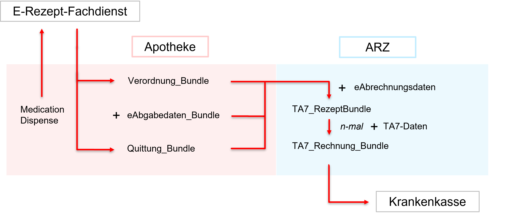

## FHIR-Beispiele zum E-Rezept

In diesem Projekt stellt der DAV Beispiele für die bei der Verarbeitung von E-Rezepten auftretenden Dateien in der Apotheke und dem Apothekenrechenzentrum zur Verfügung. Es wurde darauf geachtet, dass die zu einem Beispiel gehörenden Dateien fachlich und technisch zusammenpassen und soweit wie möglich realistische Informationen enthalten.

ACHTUNG! Der fachlich korrekte Inhalt der Beispielinstanzen kann nicht gewährleistet werden. Wir sind jederzeit dankbar für Hinweise auf Fehler oder für Verbesserungsvorschläge.

Hinweise:
- Für die Erstellung des Beispiels PZN-Verordnung Nr. 1, wurde die Referenzimplementierung (https://github.com/gematik/ref-eRp-FD-Server) Release 0.14.0 genutzt. Da dieses Release noch keine Quittungssignatur liefert und das Schlüsselmaterial eigenständig erzeugt wurde, wird im Kontext des Beispiels vorerst auf Signaturen verzichtet.

Der folgende Workflow wird betrachtet:

Zu jedem Beispiel werden folgende Dateien zur Verfügung gestellt:

**A) Verordnung**

Als Verordnungen wurden von der KBV im Projekt [https://simplifier.net/eRezept](https://simplifier.net/eRezept) veröffentlichte Beispiele genutzt. Für die Verwendung in den vorliegenden Beispiel-Verordnungs\_Bundles mussten die Verordnungen in einzelnen Feldern passend zum Task auf dem E-Rezept-Fachdienst geändert werden (insbesondere Rezept-ID, Ausstellungsdatum). 

**B) Medication Dispense**

Die Medication Dispense wird in der Apotheke aus Daten der Verordnung bzw. der Abgabedaten erzeugt und um Telematik-ID (aus der SMC-B) und Verfalldatum (aus den securpharm-Daten) ergänzt. Beim Abruf der Quittung muss die Medication Dispense an den E-Rezept-Fachdienst übergeben werden.

In den Beispielen wurde die Medication Dispense vom DAV erstellt.

**C) Quittung des E-Rezept-Fachdienstes**

Die Quittung wurde durch den E-Rezept-Fachdienst (Referenzimplementierung) erstellt.

Hinweis: Die fehlende Signatur und Profilfehler (Validator) sind bekannt und stehen im Backlog der gematik.

**D) Abgabedaten**

Die Abgabedaten wurden vom DAV bzw. der uAG Testdaten der technischen Kommission $300 erstellt.

**E) Abrechnungsdaten und TA7-Daten**

Die Abrechnungsdaten und TA7-Daten wurden fachlich von NOVENTI Health SE bzw. der uAG Testdaten der technischen Kommission $300 bereitgestellt und technisch von der gevko GmbH bzw. dem DAV in FHIR-Dateien umgesetzt.

**Ergänzende Informationen zu den einzelnen Beispielen**

**1) PZN-Verordnung Nr. 1** (Sumatriptan-1a Pharma 100 mg Tabletten TAB 12 TAB N3)

Die Verordnung basiert auf KBV-Beispiel 281a985c-f25b-4aae-91a6-41ad744080b0 (GKV). Neben den unter A) beschriebenen technisch bedingten Anpassungen wurde die Packungsgröße auf N3 geändert.

Merkmal Abgabedaten: Erfüllung Rabattvertrag

**2) PZN-Verordnung Nr. 2** (Venlafaxin - 1 A Pharma® 75mg 100 Tabl. N3)

KBV basiertes Beispiel (aea2f4c5-675a-4d76-ab9b-7994c80b64ec) mit Anpassungen (Erstellungs- & Verodnungsdatum = 27.07.2023)
- PZN-Verordnung_Nr_2 
	- Merkmal Verordnung: Kennzeichen BVG gesetzt
    - Merkmal Abgabedaten: Erfüllung Rabattvertrag

**3) PZN-Verordnung Nr. 3** (Januvia® 50 mg 28 Filmtabletten N1)

KBV basiertes Beispiel (44420ed9-7388-4be5-acc5-9c124fad9f34) mit Anpassungen (Erstellungs- & Verodnungsdatum = 27.07.2023)
- PZN-Verordnung_Nr_3 
    - Merkmal Abgabedaten: Mehrfachvertrieb

**4) PZN-Verordnung Nr. 4** (Prospan® Hustensaft 100ml N1)

KBV basiertes Beispiel (0428d416-149e-48a4-977c-394887b3d85c) mit Anpassungen (Erstellungs- & Verodnungsdatum = 27.07.2023)
- PZN-Verordnung_Nr_4 
	- Merkmal Verordnung: Gebührfrei
    - Merkmal Abgabedaten: solitärer Markt

**5) PZN-Verordnung Nr. 5** (Aciclovir 800 - 1 A Pharma® 35 Tbl. N1)

KBV basiertes Beispiel (34abcf97-6693-422e-b6f0-0ba9b232843e) mit Anpassungen (Erstellungs- & Verodnungsdatum = 27.07.2023)
- PZN-Verordnung_Nr_5
    - Merkmal Abgabedaten: Erfüllung Rabattvertrag

**6) PZN-Verordnung Nr. 6** (Doxycyclin AL 200 T, 10 Tabletten N1)

KBV basiertes Beispiel (14f3cff7-f921-429e-98ca-c65dcb367ba9) mit Anpassungen (Erstellungs- & Verodnungsdatum = 27.07.2023)

- PZN-Verordnung_Nr_6
	- Merkmal Verordnung: Entlassverordnung
    - Merkmal Abgabedaten: Erfüllung Rabattvertrag

**7) PZN-Verordnung Nr. 7** (Viani 50µg/250µg 1 Diskus 60 ED N1)

KBV basiertes Beispiel (9ad99a8f-6bce-4ab8-ada1-bb3063566c25) mit Anpassungen (Erstellungs- & Verodnungsdatum = 27.07.2023)
- PZN-Verordnung_Nr_7 
	- Merkmal Verordnung: 2 Packungen
    - Merkmal Abgabedaten: Erfüllung Rabattvertrag

**8) PZN-Verordnung Nr. 8** (Losartan STADA® 100mg 98 Filmtbl. N3)

KBV basiertes Beispiel (ee9d3b92-7667-4dfe-8331-f768b2eaca3c) mit Anpassungen (Erstellungs- & Verodnungsdatum = 27.07.2023)
- PZN-Verordnung_Nr_8 
	- Merkmal Verordnung: Ersatzverordnung
    - Merkmal Abgabedaten: Erfüllung Rabattvertrag

**9) PZN-Verordnung (Unfall)** (Novaminsulfon 500 mg Lichtenstein 100 ml Tropf. N3)

KBV basiertes Beispiel (5a3458b0-8364-4682-96e2-b262b2ab16eb) mit Anpassungen (Erstellungs- & Verodnungsdatum & Unfalltag = 27.07.2023)
- PZN-Verordnung_Unfall 
    - Merkmal Abgabedaten: Erfüllung Rabattvertrag

**10-13) PZN-Mehrfachverordnung** (L-Thyroxin Henning 75 100 Tbl. N3)

KBV basiertes Beispiel (c44ddc5b-21f5-4ce3-995d-ab5ca2633154) mit Anpassungen (Erstellungs- & Verodnungs- & StartzeitraumDatum = 27.07.2023)
- PZN_Mehrfachverordnung\PZN_MV_1
	- Merkmal Verordnung: aut idem ausgeschlossen
  - Merkmal Abgabedaten: KostenVersicherter (Mehrkosten)
    
KBV basiertes Beispiel (7031f7f3-cf51-4e77-82d7-b9bdb0a5959f) mit Anpassungen (Erstellungs- & Verodnungsdatum = 27.07.2023)
- PZN_Mehrfachverordnung\PZN_MV_2 
	- Merkmal Verordnung: aut idem ausgeschlossen
  - Merkmal Abgabedaten: KostenVersicherter (Mehrkosten)

KBV basiertes Beispiel (f70585e0-82f9-4d3d-b248-94504ccf6a66) mit Anpassungen (Erstellungs- & Verodnungsdatum = 27.07.2023)
- PZN_Mehrfachverordnung\PZN_MV_3 
	- Merkmal Verordnung: aut idem ausgeschlossen
  - Merkmal Abgabedaten: KostenVersicherter (Mehrkosten)

KBV basiertes Beispiel (15da065c-5b75-4acf-a2ba-1355de821d6e) mit Anpassungen (Erstellungs- & Verodnungsdatum = 27.07.2023)
- PZN_Mehrfachverordnung\PZN_MV_4 
	- Merkmal Verordnung: aut idem ausgeschlossen
  - Merkmal Abgabedaten: KostenVersicherter (Mehrkosten)

**14) PZN-Verordnung (Arbeitsunfall)** (Fucidine® 20mg/g Creme 15g N1)

KBV basiertes Beispiel (5f66314e-459a-41e9-a3d7-65c935a8be2c) mit Anpassungen (Erstellungs- & Verodnungsdatum & Unfalltag = 27.07.2023)
- PZN-Verordnung_Arbeitsunfall
	- Merkmal Verordnung: Arbeitsunfall (Kostenträger Unfallkasse)
    - Merkmal Abgabedaten: Abgabe preisgünstiges FAM
  
**15) PZN-Verordnung (aut idem)** (Olanzapin Heumann 20mg 70 Schmelztbl. N3)

KBV basiertes Beispiel (6d5162b2-abc9-4c0c-9c46-4deb3b64edd7) mit Anpassungen (Erstellungs- & Verodnungsdatum = 27.07.2023)
- PZN-Verordnung_aut_idem
	- Merkmal Verordnung: aut idem ausgeschlossen
    - Merkmal Abgabedaten: Erfüllung Rabattvertrag
    
**16) PZN-Verordnung (Impfstoff)** (FSME-IMMUN 0,5 ml Erwachsene FER N1)

KBV basiertes Beispiel (914b7619-621e-4270-a2b5-1cdf95c87d14) mit Anpassungen (Erstellungs- & Verodnungsdatum = 27.07.2023)

- PZN-Verordnung_Impfstoff\PZN-Verordnung_Impfstoff_V1 *(eAbgabe_V[1.x] = Abgabevarianten)*
	- Merkmal Verordnung: Kennzeichen Impfstoff gesetzt
    - Merkmal Abgabedaten: solitärer Markt
- PZN-Verordnung_Impfstoff\PZN-Verordnung_Impfstoff_V2
    - Merkmal Abgabedaten: Rezeptänderung (Abweichung Menge) + Dokumentation Rezeptänderung

**17) PZN-Verordnung (Künstliche_Befruchtung)** (GONAL-f 150 I.E./0,25ml Injektionslösung PEN 1 St N1)

KBV basiertes Beispiel (753fff3b-5373-4f8d-aa22-852792e799d8) mit Anpassungen (~~Ersatzverordnung~~, Erstellungs- & Verodnungsdatum = 27.07.2023)
- PZN-Verordnung_Künstliche_Befruchtung\PZN-Verordnung_Künstliche_Befruchtung_V1
    - Merkmal Abgabedaten: solitärer Markt, Künstliche Befruchtung
- PZN-Verordnung_Künstliche_Befruchtung\PZN-Verordnung_Künstliche_Befruchtung_V2
    - Merkmal Abgabedaten: solitärer Markt, Künstliche Befruchtung
    
**18) PZN-Verordnung (Noctu)** (INFECTOCORTIKRUPP® Zäpfchen 100 mg 3 Supp. N1)

KBV basiertes Beispiel (690a7f01-058e-492a-b1dc-d6d8c8a30a59) mit Anpassungen (Erstellungs- & Verodnungsdatum = 27.07.2023)
- PZN-Verordnung_Noctu
	- Merkmal Verordnung: Gebührfrei, noctu
    - Merkmal Abgabedaten: Notdienst-Gebühr

**19) Freitextverordnung** (Metformin 850mg Tabletten N3)

KBV basiertes Beispiel (4863d1fb-dc26-4680-bb35-018610d1749d) mit Anpassungen (Erstellungs- & Verodnungsdatum = 27.07.2023)

- Freitext-Verordnung\Freitext-Verordnung_V1
    - Merkmal Abgabedaten: Erfüllung Rabattvertrag, zusätzliche Abgabeangaben (Zusatzattribut)
- Freitext-Verordnung\Freitext-Verordnung_V2
    - Merkmal Abgabedaten: Abweichung vom Rabattvertrag (dringender Fall), Abgabe preisgünstiges FAM

**20) Rezepturverordnung (parenterale Zytostatika)** (3x 500 ml Infusionslösung (Etoposid 180 mg, NaCl 0,9 % 500 ml))                                 

KBV basiertes Beispiel (dae573db-54e3-4cb8-880d-0a46bea8aea1) mit Anpassungen (Erstellungs- & Verodnungsdatum = 24.07.2023)
- Rezeptur-parenterale_Zytostatika
	- Merkmal Verordnung: parenterale Zytostatikazubereitung für 3 Tage
    - Merkmal Abgabedaten: Zusatzdaten Herstellung für parenterale Zubereitung

Streichen: **21) Rezepturverordnung Nr. 1** (1x Viskose Aluminiumchlorid-Hexahydrat-Lösung 20 % (NRF 11.132.) 100 ml Gel Deo-Roller)

KBV basiertes Beispiel (e4372012-e010-44d9-9211-6a85ca811820) mit Anpassungen (...)
- Rezeptur-Verordnung_Nr_1 *(noch nicht kontrolliert/umgesetzt)*
  - Merkmal Abgabedaten: ...

**22) Rezepturverordnung Nr. 2** (1x 100 ml Lösung (Salicylsäure 5 g, 2-propanol 70 % Ad 100 g ))

KBV basiertes Beispiel (9581ce65-b118-4751-9073-19c091b341e0) mit Anpassungen (...)
- Rezeptur-Verordnung_Nr_2 *(noch nicht kontrolliert/umgesetzt)*
    - Merkmal Abgabedaten: Zusatzdaten Herstellung für Rezeptur

**21) Wirkstoffverordnung** (Ramipril 5 mg (ASK-Nr: 22686) Tabletten 100 Stück N3 )

KBV basiertes Beispiel (9c85a2a5-92ee-4a57-83cb-ba90a0df2a21) mit Anpassungen (Erstellungs- & Verodnungsdatum = 27.07.2023)

- Wirkstoff-Verordnung\Wirkstoff-Verordnung_V1
    - Merkmal Abgabedaten: Erfüllung Rabattvertrag
- Wirkstoff-Verordnung\Wirkstoff-Verordnung_V2
    - Merkmal Abgabedaten: Abweichung vom Rabattvertrag (dringender Fall), Abgabe preisgünstiges FAM
- Wirkstoff-Verordnung\Wirkstoff-Verordnung_V3
    - Merkmal Abgabedaten: Abweichung vom Rabattvertrag (Nicht-Verfügbarkeit + Freitext), keine Abgabe eines preisgünstigen FAM (dringender Fall)
- Wirkstoff-Verordnung\Wirkstoff-Verordnung_V4
    - Merkmal Abgabedaten: Abgabe Wunscharzneimittel

**22) Wirkstoffverordnung (Berufskrankheit)** (Gabapentin 300 mg (ASK-Nr: 22308) Tabletten 100 Stück N2)

KBV basiertes Beispiel (218b581d-ccbe-480e-b8d7-f5f9b925e8c4) mit Anpassungen (Erstellungs- & Verodnungsdatum = 27.07.2023)
- Wirkstoff-Verordnung_Berufskrankheit\Wirkstoff-Verordnung_Berufskrankheit_V1
	- Merkmal Verordnung: Berufskrankheit (Kostenträger BG)
    - Merkmal Abgabedaten: Abgabe preisgünstiges FAM, Rezeptänderung (Änderung der Stärke des Wirkstoffs)
- Wirkstoff-Verordnung_Berufskrankheit\Wirkstoff-Verordnung_Berufskrankheit_V2
    - Merkmal Abgabedaten: Abgabe preisgünstiges FAM
    
**23) Wirkstoffverordnung (Unfall)** (Diclofenac-Natrium 75 mg (ASK-Nr: 11900) Retardtabletten 20 Stück N1)

KBV basiertes Beispiel (cf0d4980-af01-44f4-a38c-d6bf14b82e07) mit Anpassungen (Erstellungs- & Verodnungsdatum & Unfalltag = 27.07.2023)
- Wirkstoff-Verordnung_Unfall
    - Merkmal Abgabedaten: Erfüllung Rabattvertrag
    
**24-25) Wirkstoff Mehrfachverordnung** (Simvastatin 20 mg (ASK-Nr: 23816) Tabletten N3)

KBV basiertes Beispiel (cd6d3a17-8105-4f1e-86ff-48cd5cebf245) mit Anpassungen (Erstellungs- & Verodnungs- & StartzeitraumDatum = 27.07.2023)
- Wirkstoff_Mehrfachverordnung\WS_MV_1
    - Merkmal Abgabedaten: Erfüllung Rabattvertrag
      
KBV basiertes Beispiel (d9118e05-6e13-4df6-af50-552401cf9ba2) mit Anpassungen (Mehrfachverordnung 2/2, Erstellungsdatum = 27.07.2023)    
- Wirkstoff_Mehrfachverordnung\WS_MV_2 
    - Merkmal Abgabedaten: Erfüllung Rabattvertrag

*... weitere Beispiele können folgen ...*
